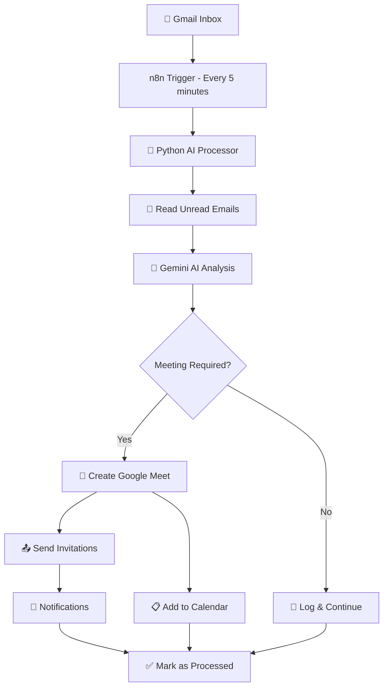

# AI Meeting Creation Automation 🤖📅

An intelligent automation system that uses **Gemini AI**, **n8n**, and **Python** to automatically read emails, analyze their content, and create Google Meet meetings with calendar invitations when needed.

## 🚀 Features

- **Smart Email Analysis**: Uses Google's Gemini AI to intelligently analyze email content
- **Automatic Meeting Detection**: Identifies when emails require face-to-face discussion
- **Google Meet Integration**: Creates meetings with video conference links automatically
- **Calendar Management**: Adds events to Google Calendar with proper scheduling
- **Participant Management**: Automatically invites people mentioned in To/CC fields
- **n8n Workflow Automation**: Visual workflow orchestration with monitoring
- **Intelligent Scheduling**: Suggests optimal meeting times based on email content

## 🏗️ Architecture & Automation Flow



### Detailed Flow:

1. **📧 Email Monitoring**: n8n triggers every 5 minutes to check for new emails
2. **🔍 Email Processing**: Python script fetches unread emails from Gmail
3. **🤖 AI Analysis**: Gemini AI analyzes each email for:
   - Meeting keywords and intent
   - Urgency level
   - Suggested participants
   - Meeting type and topics
   - Confidence score
4. **🎯 Decision Making**: Creates meeting if confidence > 70%
5. **📅 Meeting Creation**: 
   - Generates Google Meet link
   - Creates calendar event
   - Adds all relevant participants
   - Sets appropriate reminders
6. **📨 Notifications**: Sends confirmations and updates
7. **📊 Logging**: Tracks all processed emails and decisions

## 🛠️ Installation

### Prerequisites
- Python 3.8+
- Node.js (for n8n)
- Google Cloud Project with Calendar & Gmail APIs enabled
- Gemini AI API key

### Quick Setup

#### Windows:
```powershell
# Clone the repository
git clone https://github.com/HuyResearcher/meeting-creation-automation.git
cd meeting-creation-automation

# Run the installation script
.\install.bat
```

#### Linux/Mac:
```bash
# Clone the repository
git clone https://github.com/HuyResearcher/meeting-creation-automation.git
cd meeting-creation-automation

# Make installation script executable and run
chmod +x install.sh
./install.sh
```

### Manual Installation:

1. **Install Dependencies**:
   ```bash
   pip install -r requirements.txt
   npm install -g n8n
   ```

2. **Set up Environment**:
   ```bash
   cp .env.example .env
   # Edit .env with your API keys
   ```

3. **Configure Google APIs**:
   - Go to [Google Cloud Console](https://console.cloud.google.com/)
   - Enable Calendar API and Gmail API
   - Create OAuth 2.0 credentials
   - Download `credentials.json`

4. **Get Gemini API Key**:
   - Visit [Google AI Studio](https://makersuite.google.com/app/apikey)
   - Create API key
   - Add to `.env` file

5. **Run Setup**:
   ```bash
   python setup.py
   ```

## ⚙️ Configuration

### Environment Variables (.env):
```env
# Google API Configuration
GOOGLE_CREDENTIALS_PATH=credentials.json
EMAIL_ADDRESS=your_email@gmail.com
CALENDAR_ID=primary

# Gemini AI Configuration
GEMINI_API_KEY=your_gemini_api_key_here

# n8n Configuration
N8N_HOST=localhost
N8N_PORT=5678

# Processing Settings
CHECK_INTERVAL_MINUTES=5
MAX_EMAILS_PER_CHECK=50
```

### Meeting Detection Criteria:

The AI looks for emails that:
- ✅ Explicitly request meetings or calls
- ✅ Suggest coordination is needed
- ✅ Require group alignment on decisions
- ✅ Have urgency requiring immediate attention
- ✅ Contain keywords: "meeting", "call", "discuss", "sync", "standup", "review"

The AI avoids creating meetings for:
- ❌ Simple information sharing
- ❌ FYI emails
- ❌ Automated notifications
- ❌ Thank you messages
- ❌ Simple confirmations

## 🚀 Usage

### 1. Start n8n Workflow:
```bash
# Start n8n
n8n start

# Import workflow (in n8n interface):
# 1. Go to http://localhost:5678
# 2. Import n8n-workflow.json
# 3. Activate the workflow
```

### 2. Test the Automation:
```bash
# Run comprehensive tests
python test_automation.py

# Manual email processing
python ai_meeting_automation.py
```

### 3. Monitor Operations:
- **n8n Dashboard**: http://localhost:5678
- **Workflow Logs**: Check n8n execution logs
- **Email Processing**: Monitor console output
- **Google Calendar**: Check for created meetings

## 📊 Example Scenarios

### Scenario 1: Project Discussion Email
**Input Email**:
```
Subject: Project Deadline Discussion
From: john@company.com
To: team@company.com, manager@company.com

Hi team,

I think we should schedule a meeting to discuss the upcoming 
project deadline. Let's sync up on the requirements and timeline.

Please let me know your availability for tomorrow or Friday.

Thanks,
John
```

**AI Analysis Result**:
```json
{
  "requires_meeting": true,
  "meeting_title": "Project Deadline Discussion",
  "meeting_description": "Sync up on project requirements and timeline",
  "suggested_duration": 60,
  "urgency": "medium",
  "participants": ["john@company.com", "team@company.com", "manager@company.com"],
  "meeting_type": "discussion",
  "confidence_score": 0.92
}
```

**Automation Result**: ✅ Meeting created with Google Meet link

### Scenario 2: Information Sharing Email
**Input Email**:
```
Subject: Weekly Report
From: admin@company.com
To: all@company.com

Hi everyone,

Here's this week's performance report attached.
No action required, just for your information.

Best regards,
Admin
```

**AI Analysis Result**:
```json
{
  "requires_meeting": false,
  "meeting_type": "information_sharing",
  "confidence_score": 0.15
}
```

**Automation Result**: ❌ No meeting created

## 🔧 Customization

### Modify AI Prompts:
Edit the prompt in `ai_meeting_automation.py` → `GeminiAI.analyze_email()` method to customize meeting detection logic.

### Adjust Meeting Settings:
```python
# Default meeting duration
"suggested_duration": 60,  # minutes

# Confidence threshold
if analysis.get('confidence_score', 0) > 0.7:  # 70% confidence

# Default meeting time
def _get_next_business_day_time(self):
    # Default: next business day at 2 PM
```

### Custom n8n Nodes:
Add additional nodes to the workflow for:
- Slack notifications
- Teams integration
- Database logging
- Custom webhooks

## 🔍 Monitoring & Troubleshooting

### Logs Location:
- **n8n Logs**: n8n dashboard → Executions
- **Python Logs**: Console output
- **Google API Logs**: Check token.pickle validity

### Common Issues:

1. **Authentication Errors**:
   ```bash
   # Re-run authentication
   rm token.pickle
   python setup.py
   ```

2. **API Quota Exceeded**:
   - Check Google Cloud Console quotas
   - Increase limits or reduce check frequency

3. **Gemini AI Errors**:
   - Verify API key in `.env`
   - Check API quota at Google AI Studio

4. **Meeting Creation Fails**:
   - Check calendar permissions
   - Verify participant email addresses
   - Ensure calendar ID is correct

### Testing Commands:
```bash
# Test individual components
python test_automation.py

# Debug email processing
python -c "from ai_meeting_automation import EmailProcessor; EmailProcessor().process_emails()"

# Check Google authentication
python -c "from ai_meeting_automation import GoogleCalendarManager; GoogleCalendarManager('credentials.json')"
```

## 🤝 Contributing

1. Fork the repository
2. Create feature branch: `git checkout -b feature-name`
3. Commit changes: `git commit -am 'Add feature'`
4. Push to branch: `git push origin feature-name`
5. Submit pull request

## 📄 License

This project is licensed under the MIT License - see the [LICENSE](LICENSE) file for details.

## 🙏 Acknowledgments

- **Google Gemini AI** for intelligent email analysis
- **n8n** for workflow automation
- **Google Calendar API** for meeting management
- **Gmail API** for email processing

## 📞 Support

For issues and questions:
- Create an [Issue](https://github.com/HuyResearcher/meeting-creation-automation/issues)
- Check the [Wiki](https://github.com/HuyResearcher/meeting-creation-automation/wiki)
- Review troubleshooting section above

---

**Made with ❤️ by AI Automation**